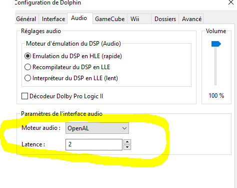
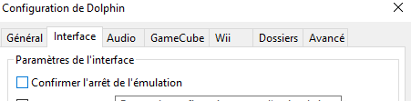
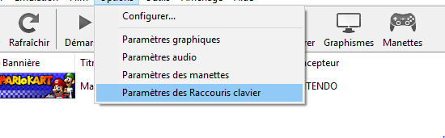
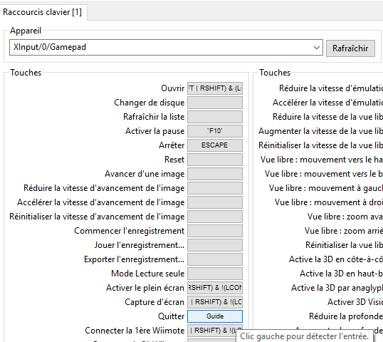

## Dolphin configuration

### No sound on Raspberry Pi

Change audio to OpenHAL

### Exit dolphin without confirmation

Desactivate «confirm emulator stop»

### Exit Dolphin with PS button

Go to hotkeys menu

Add a shortcut to quit command

